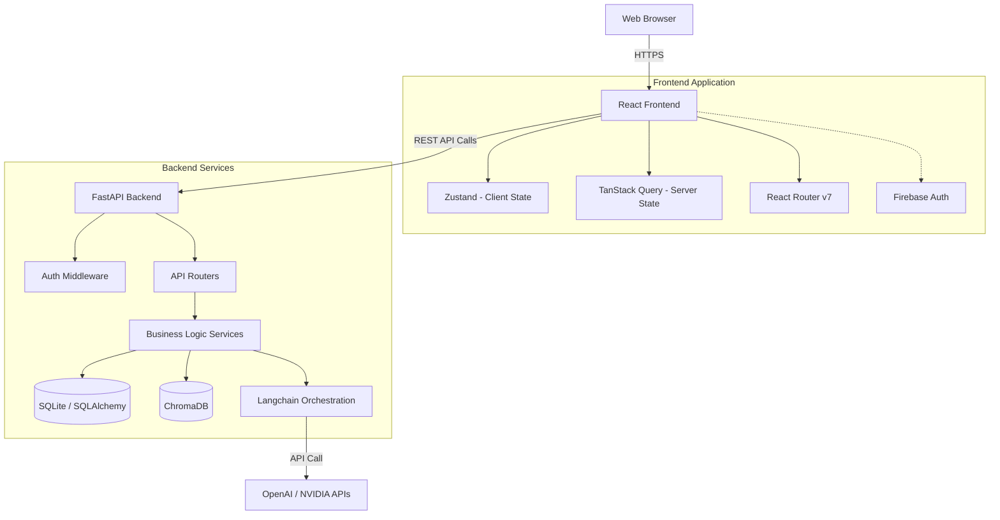

# Architecture

HireIntel AI follows a modern, decoupled architecture split into a high-performance Single Page Application (SPA) frontend and a Python-powered REST API backend utilizing advanced machine learning pipelines.

## High-Level System Design

## 1. Frontend Architecture

The frontend is built using **React 19** and **Vite** with **TypeScript** for strict type safety. 

### Core Libraries
- **React Router v7:** Handles all client-side navigation.
- **TanStack Query (React Query):** Manages server-state, caching, background fetching, and synchronization of candidate and job data.
- **Zustand:** A lightweight state management library used for managing global client-side state (e.g., UI theme, current authenticated user).
- **Tailwind CSS v4:** Utility-first CSS framework utilizing modern `@theme` tokens for rapid and consistent UI development.
- **React Hook Form + Zod:** Handles complex form state (like job creation) with strict schema validation.
- **TanStack Table:** Powers the interactive candidate pipelines with sorting, filtering, and pagination.

### Authentication Flow (Frontend)
1. The user logs in via a Firebase Authentication UI popup (Google OAuth or Email/Password).
2. Firebase SDK handles the secure exchange and returns a short-lived ID token.
3. The frontend captures this ID token and includes it in the `Authorization: Bearer <token>` header of subsequent API requests to the backend.

## 2. Backend Architecture

The backend is a **FastAPI** application that provides a high-performance asynchronous REST API.

### Core Components
- **Routers (`app/api/endpoints`):** Define the HTTP endpoints (e.g., `/candidates`, `/jobs`). They rely on Dependency Injection to get database sessions and verify user authentication.
- **Schemas (`app/schemas`):** Pydantic v2 models that strictly validate incoming request payloads and format outgoing responses.
- **Models (`app/models`):** SQLAlchemy ORM models representing the relational data (e.g., `User`, `Job`, `Candidate`).
- **Services (`app/services`):** The core business logic, including the AI processing pipelines.
- **Database (`app/core/database.py`):** Uses SQLite by default, though SQLAlchemy makes it trivial to swap to PostgreSQL for production deployments.

### Authentication Flow (Backend)
1. The backend receives a request with an `Authorization: Bearer <token>` header.
2. The `get_current_user` dependency intercepts the request.
3. It verifies the token either against Firebase Admin SDK (if configured) or decodes the local JWT using the `JWT_SECRET`.
4. If valid, it extracts the `user_id` and allows the request to proceed.

## 3. AI Processing Pipeline

The most critical feature of HireIntel AI is its semantic processing engine. It avoids simple keyword matching in favor of vector embeddings.

### 3.1 Job Parsing Workflow
When a recruiter pastes a raw job description:
1. The text is sent to the backend `/api/v1/jobs/analyze` endpoint.
2. **Langchain** routes the text to an LLM provider (OpenAI or NVIDIA, depending on the `DEFAULT_AI_PROVIDER` environment variable).
3. The LLM is prompted to extract structured JSON data (Title, Department, Core Skills, Soft Skills).
4. The structured data is returned to the frontend to pre-fill the job creation form.

### 3.2 Candidate Embedding Workflow
When a candidate is added to the system (via bulk upload or manual entry):
1. The backend concatenates the candidate's core skills, experience, and title into a "semantic summary".
2. This summary is passed to a **Sentence Transformer** model (`all-MiniLM-L6-v2`) running locally via the Hugging Face `transformers` library.
3. The model generates a high-dimensional vector (embedding) representing the semantic meaning of the candidate's profile.
4. This embedding, along with the candidate's ID and metadata, is saved into a local **ChromaDB** instance.
5. The relational data (name, email, status) is saved to the SQLite database.

### 3.3 Semantic Search Workflow
When a recruiter views a Job to find matching candidates:
1. The backend generates a semantic summary of the *Job Requirements* (core skills, title, etc.).
2. This summary is embedded using the exact same Sentence Transformer model.
3. The backend queries **ChromaDB** with this job vector, asking for the top N closest candidate vectors using Cosine Similarity.
4. ChromaDB returns the IDs of the best-matching candidates.
5. The backend fetches these candidates from the SQLite database, calculates a percentage match score based on the vector distance, and returns the sorted list to the frontend.

## 4. Rate Limiting and Security

To prevent abuse of expensive LLM endpoints or file upload limits, the application uses **SlowAPI** to enforce rate limits on specific routes (e.g., `10/minute` for `/analyze`). Note: Complex endpoints utilizing `UploadFile` dependencies may require careful configuration to avoid AST parsing issues with Pydantic 2.x and FastAPI 0.111.0.
