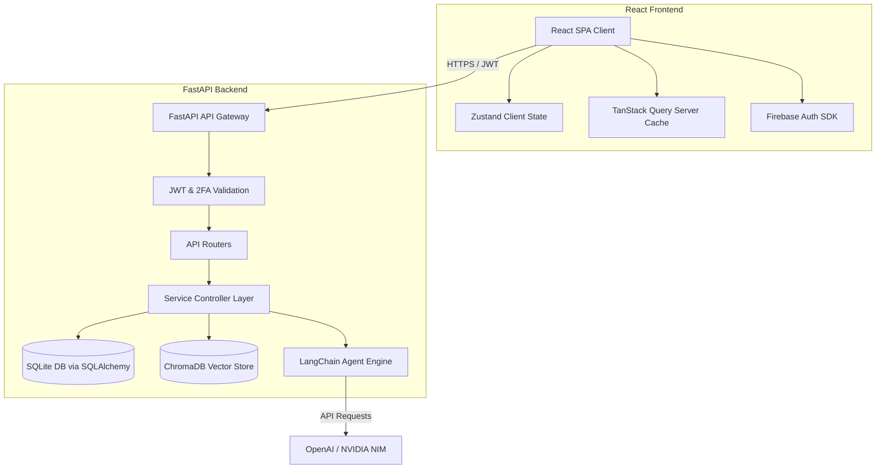
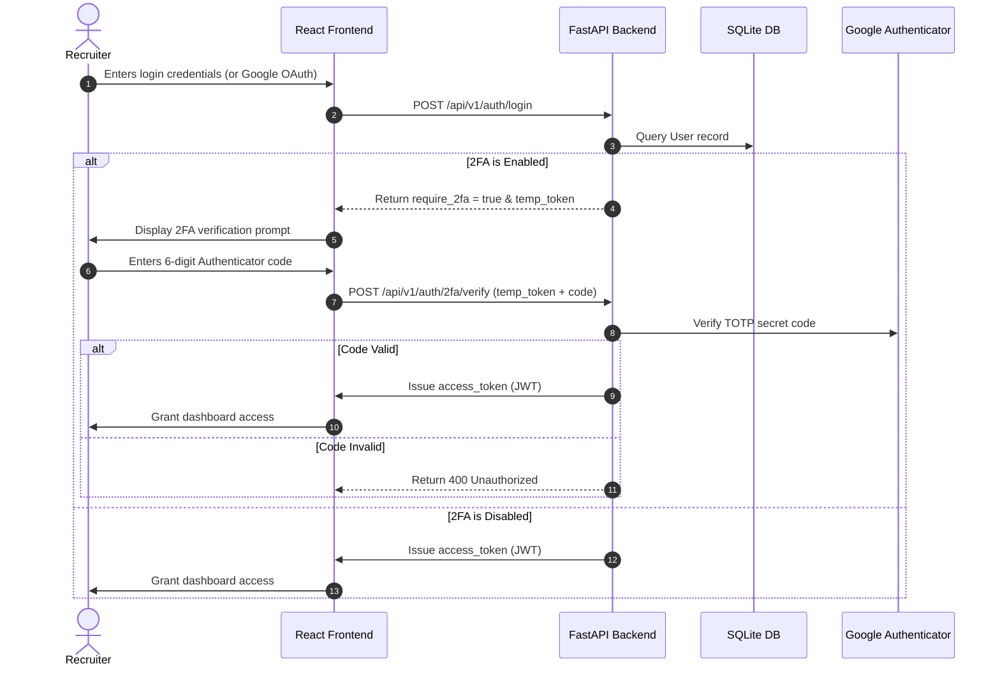

# 🚀 HireIntel AI — Next-Gen Enterprise Talent Platform

[](https://github.com/chaitrapophale/HireIntel-AI)
[](LICENSE)
[](https://react.dev)
[](https://fastapi.tiangolo.com)
[](https://python.org)
[](https://trychroma.com)

**HireIntel AI** is a state-of-the-art enterprise recruitment platform built for technical recruiters, hiring managers, and HR teams. Leveraging advanced **Semantic Search**, local **Vector Embeddings (ChromaDB)**, and LLM-powered **Job Parsing**, HireIntel AI eliminates the limitations of traditional keyword-based Applicant Tracking Systems (ATS) to discover high-potential "Hidden Gems" and streamline candidate evaluation.

---

## 📌 Table of Contents
1. [💡 The Problem & The Solution](#-the-problem--the-solution)
2. [✨ Key Features](#-key-features)
3. [🛠️ Tech Stack](#%EF%B8%8F-tech-stack)
4. [📐 Architecture & System Design](#-architecture--system-design)
5. [🤖 AI & Machine Learning Pipeline](#-ai--machine-learning-pipeline)
6. [🔐 Security & Hardening (With 2FA)](#-security--hardening-with-2fa)
7. [📂 Project Structure](#-project-structure)
8. [⚙️ Installation & Local Setup](#%EF%B8%8F-installation--local-setup)
9. [🔌 API Endpoints](#-api-endpoints)
10. [🔮 Future Roadmap](#-future-roadmap)
11. [📄 License](#-license)

---

## 💡 The Problem & The Solution

### The Problem
Traditional Applicant Tracking Systems (ATS) rely on exact keyword matching. Outstanding candidates are routinely filtered out because they described their skills differently than the recruiter phrased the job posting (e.g., matching "NLP" but ignoring "Language Modeling"). Additionally, recruitment platforms suffer from:
- **No context comprehension:** High-potential candidates with non-traditional educational backgrounds (self-taught developers, bootcamp grads) are immediately rejected by rigid automated systems.
- **Manual Overhead:** Copying and pasting raw job listings to draft structured schemas is time-consuming.
- **Fragile Security:** Traditional candidate portals contain sensitive personally identifiable information (PII) but lack robust multi-factor authentication (MFA) or robust session controls.

### The HireIntel AI Solution
HireIntel AI solves this by embedding both candidate resumes and job criteria into the same high-dimensional vector space:
- **Semantic Vector Matching:** It matches candidates based on the *meaning* of their experiences rather than literal string matches.
- **LLM-Based Autocomplete:** Extracts structured fields (Core Skills, Soft Skills, Locations) from plain-text job descriptions automatically.
- **"Hidden Gems" Identification:** Uses intelligent scoring algorithms to flag high-potential talent who possess stellar technical accomplishments but miss conventional requirements (such as degrees or specific years of experience).
- **Enterprise-Grade Security:** Hardened with **Firebase Authentication**, **JWT Session Tokens**, and **Google Authenticator (TOTP) Two-Factor Authentication**.

---

## ✨ Key Features

* **⚡ Interactive Recruiting Pipeline:** A highly responsive dashboard tracking candidate statuses from *Sourced* to *Offer Extended* using **TanStack Table** and **Zustand**.
* **🧠 Local Semantic Vector Search:** Powered by `SentenceTransformers` (`all-MiniLM-L6-v2`) and a local persistent **ChromaDB** instance. All vector search is fast and runs locally.
* **📈 Rich Skill Visualization:** Multi-dimensional radar charts showing candidate qualifications comparing soft skills, tech skills, and career experience side-by-side using **Recharts**.
* **📝 Automated Job Structuring:** Paste raw job descriptions, and let an AI model (OpenAI or NVIDIA Llama-3.3-Nemotron via **LangChain**) instantly extract structured data to prefill recruitment forms.
* **🔐 Google Authenticator 2FA (TOTP):** Users can easily setup, enable, verify, or disable two-factor authentication from their Settings dashboard. If enabled, the login screen requires a 6-digit TOTP code.
* **📦 Bulk Dataset Import:** Supports uploading spreadsheets (`.csv`, `.json`, `.xlsx`) to import hundreds of candidates in seconds, generating vector embeddings automatically in the background.

---

## 🛠️ Tech Stack

### Frontend
* **Core:** React 19 + TypeScript + Vite
* **Routing:** React Router v7
* **State Management:** Zustand (Client state), TanStack Query v5 (Server cache state)
* **Styling:** Tailwind CSS v4 + sleek custom theme configurations
* **Visualization:** Recharts (Radar charts, funnel flows)
* **Tables:** TanStack Table v8 (highly interactive, searchable, sortable tables)

### Backend
* **Framework:** FastAPI (Python 3.11 / 3.12)
* **ORM:** SQLAlchemy v2.0
* **Database:** SQLite (Default for portability) + Alembic for migrations
* **Rate Limiting:** SlowAPI (Token bucket algorithm)
* **Auth & Security:** Firebase Admin SDK (Google OAuth) + Custom JWTs + `pyotp` (Google Authenticator TOTP)

### AI / Machine Learning
* **Vector Store:** ChromaDB (Persisted locally)
* **Embeddings:** Sentence Transformers (`all-MiniLM-L6-v2`)
* **Orchestration:** LangChain (LLM parsers and prompt templates)
* **Providers:** OpenAI API, NVIDIA NIM (Llama 3.3 Nemotron / NV-Embed-QA)

---

## 📐 Architecture & System Design

HireIntel AI follows a clean, decoupled client-server architecture:



### Data Flow Execution Model
1. **Extraction:** A recruiter pastes a job description. The frontend requests parsing, and the backend routes the request through LangChain to extract a structured schema.
2. **Indexing:** When resumes are uploaded, the backend constructs a semantic summary of the candidates, feeds it into `SentenceTransformer` to generate a 384-dimension vector, and saves it into **ChromaDB**.
3. **Matching:** The system embeds the job requirements, queries ChromaDB using **Cosine Similarity**, and computes a final match percentage, returning candidate profiles ranked by suitability.

---

## 🤖 AI & Machine Learning Pipeline

Unlike keyword parsers, HireIntel AI uses **Deep Learning embeddings** to capture semantic similarity.

### The Embedding Model: `all-MiniLM-L6-v2`
- Converts text summaries into a dense **384-dimensional space**.
- Captures context: maps "React specialist" close to "frontend engineer with Next.js expertise" despite different phrasing.

### The Matching Engine:
- **ChromaDB Querying:** Considers candidate background, skills, and projects.
- **Cosine Distance Calculation:** Converts distance vectors to standard percentages:
  $$\text{Match } \% = \left( 1 - \text{Cosine Distance} \right) \times 100$$
- **Hidden Gems Heuristic:** Flags profiles with lower traditional metrics (e.g., years of experience) that rank highly in the semantic match, identifying candidates with high capability but atypical histories.

---

## 🔐 Security & Hardening (With 2FA)

To meet enterprise standards, HireIntel AI implements a robust authentication and authorization framework.



* **Multi-Factor Auth:** Generates secure provisioning URLs containing TOTP secrets compatible with Google Authenticator, Authy, or Microsoft Authenticator.
* **Token Rotation:** Validates standard JWT session tokens alongside temporary 2FA-challenge authorization tokens.
* **Rate-Limiting:** Utilizes `SlowAPI` to enforce request quotas on expensive AI parsing endpoints.

---

## 📂 Project Structure

```text
hireintel-ai/
├── backend/                  # FastAPI Application
│   ├── alembic/              # DB Schema Migration Scripts
│   │   ├── versions/         # Alembic migration version history
│   │   └── env.py            # Migration runtime config
│   ├── app/
│   │   ├── api/              # API endpoints and dependency validators
│   │   │   └── endpoints/    # auth.py, candidates.py, jobs.py, dashboard.py, etc.
│   │   ├── core/             # Configuration, Database engine, Security utils
│   │   ├── models/           # SQLAlchemy database tables (User, Candidate, Job)
│   │   ├── schemas/          # Pydantic schemas (request and response formatting)
│   │   └── services/         # Core business logic services & vector DB handlers
│   ├── chroma_db/            # Local SQLite vector database storage
│   ├── requirements.txt      # Python library dependencies
│   └── alembic.ini           # Alembic settings file
├── frontend/                 # React Application
│   ├── src/
│   │   ├── components/       # Common UI elements (Cards, Buttons, Tables)
│   │   ├── features/         # Features (auth, dashboard, candidates, settings)
│   │   │   ├── auth/         # LoginPage.tsx, ProtectedRoute.tsx
│   │   │   ├── settings/     # SettingsPage.tsx (Google Authenticator 2FA)
│   │   │   └── dashboard/    # DashboardPage.tsx
│   │   ├── hooks/            # Custom reusable hooks
│   │   ├── lib/              # API configs, Axios clients, Firebase configuration
│   │   ├── store/            # Zustand global client stores
│   │   └── types/            # TypeScript schemas and definitions
│   ├── package.json          # Node dependencies list
│   └── vite.config.ts        # Vite configuration
└── README.md                 # Project README
```

---

## ⚙️ Installation & Local Setup

### Prerequisites
* **Node.js v18+**
* **Python 3.11 / 3.12**
* **Git**

### Clone Project
```bash
git clone https://github.com/chaitrapophale/HireIntel-AI.git
cd HireIntel-AI
```

### 1. Backend Setup
1. Move to backend folder:
   ```bash
   cd backend
   ```
2. Create and run a python virtual environment:
   ```bash
   python -m venv .venv
   # Windows:
   .venv\Scripts\activate
   # macOS/Linux:
   source .venv/bin/activate
   ```
3. Install dependencies:
   ```bash
   pip install -r requirements.txt
   ```
4. Create configuration file:
   ```bash
   cp .env.example .env
   ```
   Add a random `JWT_SECRET`, and optional API keys for `GEMINI_API_KEY` or `NVIDIA_API_KEY`.
5. Run migrations to initialize the database:
   ```bash
   alembic upgrade head
   ```
6. Start the server:
   ```bash
   python -m uvicorn app.main:app --reload --port 8000
   ```
   Interactive documentation will be running at [http://localhost:8000/docs](http://localhost:8000/docs).

### 2. Frontend Setup
1. Move to frontend folder:
   ```bash
   cd ../frontend
   ```
2. Install libraries:
   ```bash
   npm install
   ```
3. Configure environment variables:
   ```bash
   cp .env.example .env
   ```
   Populate the Firebase configuration parameters (API key, domains, app ID) in your newly created `.env` file.
4. Run dev server:
   ```bash
   npm run dev
   ```
   The client will boot up at [http://localhost:5173](http://localhost:5173).

---

## 🔌 API Endpoints

| Method | Endpoint | Description | Auth Required |
|--------|----------|-------------|---------------|
| **POST** | `/api/v1/auth/login` | Authenticate user credentials / Issue 2FA Challenge | No |
| **POST** | `/api/v1/auth/2fa/verify` | Verify Google Authenticator code & issue session JWT | No |
| **GET** | `/api/v1/auth/2fa/setup` | Generate a new TOTP secret & QR provisioning URI | **Yes** |
| **POST** | `/api/v1/auth/2fa/enable` | Verify first code and activate 2FA | **Yes** |
| **POST** | `/api/v1/auth/2fa/disable` | Verify code and turn off 2FA | **Yes** |
| **POST** | `/api/v1/jobs/analyze` | Parse job listings to JSON schemas (LLM-based) | **Yes** |
| **GET** | `/api/v1/candidates/search` | Retrieve candidates ranked by semantic matching | **Yes** |
| **POST** | `/api/v1/candidates/upload-dataset` | Bulk ingest resumes and save to ChromaDB | **Yes** |

---

## 🔮 Future Roadmap

- [ ] **Multi-Agent Collaboration:** Implement LangGraph agents to run mock interviews with candidates automatically.
- [ ] **Cross-Platform integrations:** Connect directly with ATS systems such as Greenhouse, Workday, and Lever.
- [ ] **Resume Ingestion Engine:** Integrated OCR parsers (`pdfplumber` / PyPDF) directly in the app to read files without third-party converters.
- [ ] **Real-time Pipeline sync:** WebSockets connectivity for multi-recruiter workspace collaboration.

---

## 📄 License

Distributed under the MIT License. See [LICENSE](LICENSE) for more information.
